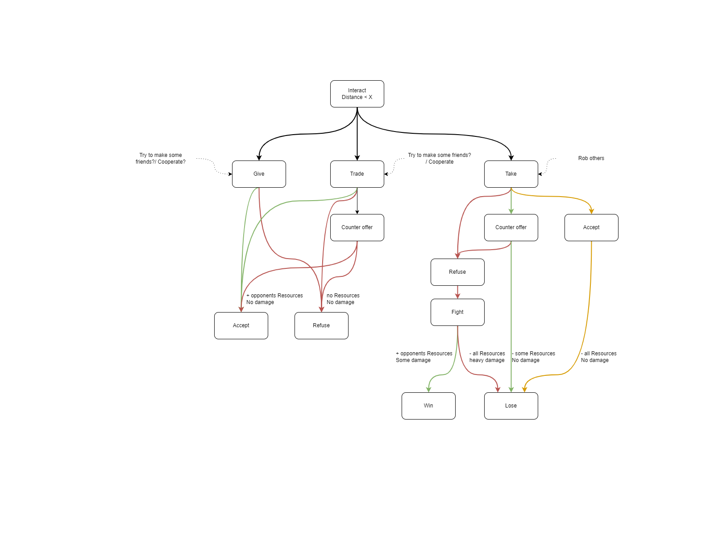

# GreedyGrabbers
Coding Challenge Game

## Overview
GreedyGrabbers is a competitive game where players write their own bots in Python
to compete against each other in a resource collection and strategy game.
The game will be played on a 2D world where players must navigate their bots to collect resources while avoiding obstacles and competing against other players' bots.

## Game Mechanics

### Bot

Each bot has two-dimensional movement, allowing it to navigate the world freely.
Initially, all bots have the same movement speed, but this can be upgraded by spending resources.
Bots also have a maximum carrying capacity for the resources they collect, so players must manage their bot's inventory carefully.

To explore the world, bots have limited vision and must rely on their sensors to detect resources and other bots.
However, bots also produce noise when they move, which can be detected by other bots.
This means that players must balance the benefits of exploration with the risk of alerting other bots to their presence.
As players collect more resources and upgrade their bots, they can improve their vision and reduce the noise their bots produce,
making it easier to move undetected through the world.

### World

Each bot begins at a home base located in the corners of the map. From their starting point, 
bots can venture out into the world to collect resources that are scattered throughout. While the outer regions of the world have relatively easy-to-reach resources,
the center of the world boasts the most valuable resources. However, the center is also home to more obstacles, making it a challenging area to navigate.

Any resources that a bot collects and brings back to its home base are added to that bot's total amount of available resources. 
Players will need to balance the risk and reward of venturing into the center of the world, 
where the potential for greater rewards is balanced by greater challenges. 

### Interactions
Bots can Give, Trade, Steal, or Fight to try gain more resources without having to collecting them in the world.

### Senses
Each bot possesses the ability to perceive their surroundings and detect other bots using both their auditory and visual senses, albeit restricted within their respective fields of vision.

### Upgrades
There are many upgrades that can be bought using the collected resources. This allows for diffrent strategys that the player can chose when creating there bot.
 * Storage
 * Speed
 * Stealth
 * Sense
 * Defense
 * Attack

## Rules
 1. Targetting a specific other bot is not allowed, although you may target the tactics of a general class of bot. This mostly means you may not reverse engineer someone's bot and then create a bot that effectively neutralizes it because you know it's next move.
 2. Bots may work together but may not communicate with each other other than the game world. The wins will be awarded individually rather than as a team.
 3. You may not attempt to alter other bot's internal state, or any other internal game variables, f.i. id, position, the world, etc.
 4. Your bot may not intentionally crash. During the tournament any crashes of your bot will be treated as empty command.
 5. Please limit the processing time of your bot. Currently there's a hard limit of 50ms average time-per-move as measured on my laptop using time_trails.py. Please talk to me (Hein) if you think this is too short. You can also use a profiler to try and make your code faster.
 6. Your bot must be your own creation. This rule is so that you may not blatantly copy someone's bot, change only a few lines, and then submit it as your own. Some code duplication is of course inevitable and thus allowed, because the logic might be similar between bots.
 7. Limmited multithreading is allowed.
